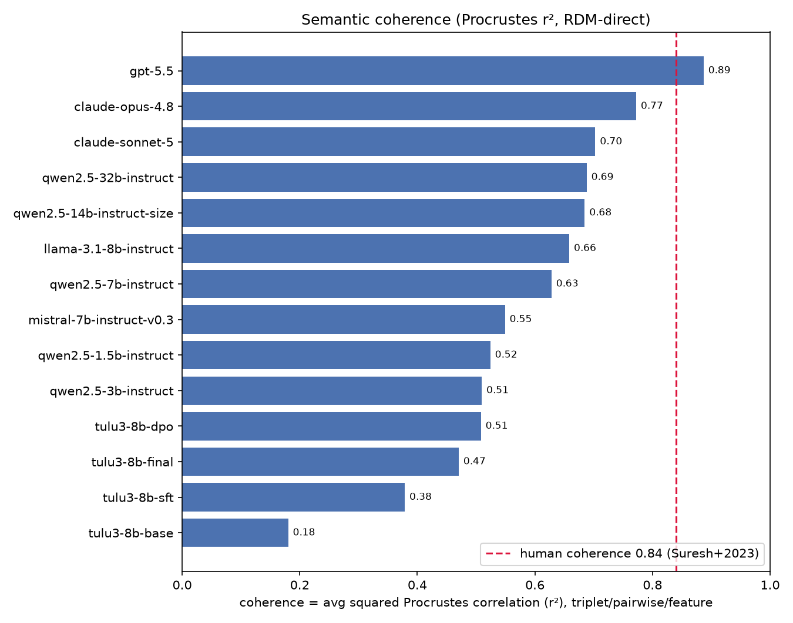
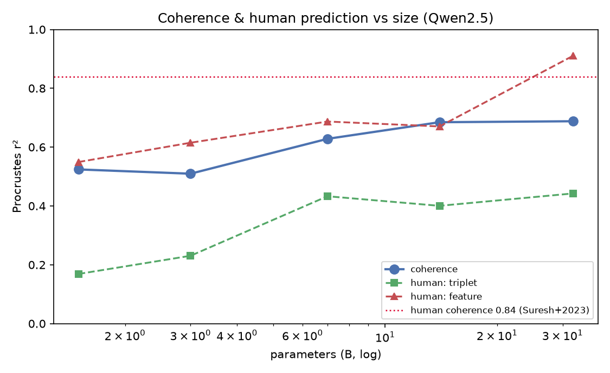
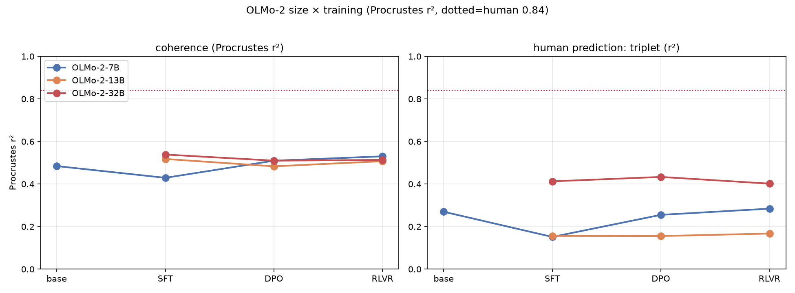
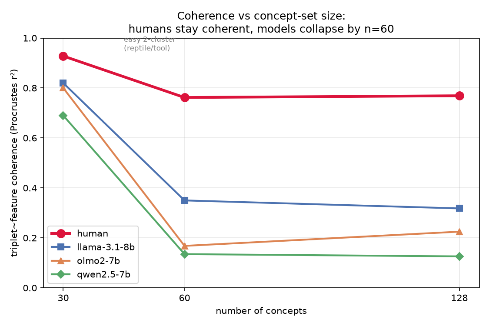

# Conceptual Coherence in Modern LLMs — Project Report

*Bridge experiment for dissertation chapters 1–2. Re-runs the three semantic
elicitation methods from Suresh et al. 2023 (EMNLP, "Conceptual structure coheres
in human cognition but not in large language models") on modern models, using the
paper's exact human data and metric.*

---

## 1. Question

The 2023 EMNLP paper showed that **human** conceptual structure is *coherent* — the
similarity space you recover from feature-listing, triadic (triplet) judgments, and
pairwise ratings all agree — whereas **GPT-3-era LLMs were not** (their three elicited
spaces disagreed). We ask: **does that still hold for frontier and modern open models?**
And: what drives coherence — model size, instruction tuning, or RL?

Same 30 concepts as the paper (15 reptiles + 15 tools). Three methods per model:
**triplet** (which of two is more similar to an anchor), **pairwise** (1–7 rating),
**feature** (True/False verification over a per-model feature union).

## 2. Metric (validated against the paper)

The paper's coherence metric is the **squared Procrustes correlation, r² = 1 − Procrustes
disparity** ("% of variance in one space explained by another after optimal alignment").
We reproduced this exactly:

- The paper's saved output table (`humans_all_tasks_correlation_table.csv`) stores the
  Procrustes correlation **r** = `sqrt(1 − protest ss)`: **0.979 / 0.915 / 0.846**.
- The paper *text* reports **r²** = those values squared: **0.96 / 0.84 / 0.72** (mean **0.84**).
  This r-vs-r² distinction resolved a long apparent discrepancy.
- Alignment is done **RDM-direct** (Procrustes on the full 30×30 distance matrices), which
  reproduces the paper's saved table (our 0.98 / 0.92 / 0.85 vs their 0.98 / 0.92 / 0.85).

**Human coherence ceiling = 0.84 (r²).** This is the bar every model is measured against.

### Triplet embeddings use SALMON (the paper's method)
Triplet judgments are *relative*, so they cannot form a similarity matrix directly. Both
human and model triplet spaces are fit with **SALMON `OfflineEmbedding` (d=3, 8000 epochs)**
from the raw (head, winner, loser) judgments, then cosine-distanced — exactly as the paper.
All 26 models with valid triplet data fit cleanly: **held-out triplet accuracy 0.71–0.89**
(none below 0.6), well above the 0.5 chance level and near/above the human 0.75.

## 3. Main findings

### Finding 1 — The 2023 result reverses for modern models.

Frontier models are now **as coherent as, or more coherent than, humans**. The original
"humans cohere, LLMs don't" finding was specific to GPT-3; it no longer holds.

| model | coherence (r²) | vs human 0.84 |
|---|---|---|
| **gpt-5.5** | **0.91** | above |
| claude-opus-4.8 | 0.78 | near |
| claude-sonnet-5 | 0.70 | below |
| qwen2.5-32b-instruct | 0.70 | below |
| qwen2.5-14b | 0.64 | below |
| llama-3.1-8b | 0.59 | below |
| … 8B/small/base | 0.05–0.51 | well below |

GPT-5.5 beats humans on **every** pairwise component (triplet~pairwise 0.86 vs 0.72,
triplet~feature 0.94 vs 0.90, pairwise~feature 0.94 vs 0.83) — not a single lucky pair.

### Finding 2 — Coherence and human-alignment rise monotonically with model size.

Qwen2.5 from 0.5B → 32B: coherence climbs 0.09 → 0.70, and human-prediction climbs in
lockstep (human-triplet 0.17 → 0.96). Size is the dominant driver.

### Finding 3 — Size and RL act on *different* things.

Across the OLMo-2 lineage (7B/13B/32B × base/SFT/DPO/RLVR):
- **Size** drives *human alignment* — 32B stages align at ~0.6–0.9 regardless of post-training.
- **RL/post-training** drives *cross-method coherence* mainly at **7B** (base 0.27 → instruct 0.50);
  the effect is flat or noisy at 13B/32B. Post-training and scale improve different axes.

### Finding 4 — Post-training improves *reporting*, not representation (OLMo/Tülu dual measurement).

Measuring the same lineage two ways: **generation** (follow the instruction) vs **logprob**
(uniform, representation-level). Generation coherence *rises* with SFT→DPO→RLVR, but logprob
coherence is *flat/slightly down*. The pretrained representation already encodes a coherent
structure; post-training changes how accessibly it is **expressed**, not how coherent it **is**.

### Finding 5 — GPT-5.5 explains human variance almost perfectly.

GPT-5.5 predicts the human spaces at **triplet 0.997, feature 0.96, pairwise 0.89**. This
tracks model quality (Qwen 0.5B→32B: human-triplet 0.17→0.96), so it is a real signal, not a
metric artifact (a bad model with the same 3D construction scores 0.17).

### Finding 6 — The human ceiling cannot be raised by LLM re-verification.

We tested whether re-verifying the Leuven feature norms with the NOVA recipe (flan-xxl
stage-1 over 60,780 concept×feature pairs, then gpt-5.5 stage-2 pruning) yields a *more*
coherent human feature space. It does **not**: the two-stage matrix (0.77) stays below the
original Leuven (0.81). The damage is the **union step** — verifying against the full
2,026-feature union restructures the space away from Leuven's native per-concept lists,
breaking the tight triplet~feature alignment. The paper's zero-fill of cross-domain cells
is near-optimal; a Leuven-within + NOVA-cross-domain hybrid merely ties it (0.810 vs 0.813).
**The 0.84 ceiling stands, now stress-tested from three angles.**

### Finding 7 — Coherence collapses with concept-set size, for models but not humans.

We repeated the experiment on **128 concepts** (category-balanced across 13 categories,
all present in both THINGS SPoSE and NOVA). Human triplet = THINGS SPoSE 49D; human
feature = NOVA verified matrix. Model triplet = SALMON at **d=5** (chosen by an empirical
held-out-accuracy elbow — accuracy plateaus after d=5); model feature = free-listing
consolidated to features **shared by ≥3 concepts** (~55–272 features/model, Leuven-scale),
then self-verified. All r² (RDM-direct Procrustes), same metric as n=30.

| triplet~feature (r²) | n=30 | n=60 | n=128 |
|---|---|---|---|
| **Human** | 0.93 | **0.76** | 0.77 |
| qwen2.5-32b | 0.94 | *(H100)* | **0.34** |
| llama-3.1-8b | 0.82 | 0.35 | 0.32 |
| olmo2-7b | 0.80 | 0.17 | 0.23 |
| qwen2.5-7b | 0.69 | 0.14 | 0.13 |

**Humans stay coherent (0.93 → 0.76 → 0.77); models collapse (near-human at n=30 → ≤0.35
by n=60, and stay down).** The three-point curve shows the collapse is a **threshold
effect, essentially complete by n=60** (n=60 ≈ n=128 for every row) — not a gradual decay.
The models' apparent coherence at 30 concepts was largely the easy 2-cluster reptile/tool
separation; escaping that trivial structure (by ~60 diverse concepts) fully opens the
model↔human gap. **This partially reverses Finding 1:** the impression that modern models
match human coherence is concept-set-dependent. At scale, the 2023 "humans cohere, LLMs
don't" result **holds even for strong models** — the 30-concept task was too easy to reveal
it. Concept-set size is a critical confound for this whole line of work.
(n=60 uses a category-balanced subset nested in the 128; qwen2.5-32b n=60/128 pending H100.)

(Model feature spaces still align with human NOVA at 0.48–0.71 and triplets at 0.15–0.49;
the collapse is specifically in the *internal* triplet↔feature agreement, i.e. coherence.)

## 4. Reliability checks

- **Batched vs single-pair feature verification.** Frontier models can be verified 20-at-a-time
  (GPT-5.5: 92% agreement, κ=0.82). Open/small models cannot — Llama rubber-stamps "True" down
  a list (κ=0.10); they must be verified single-pair. Policy enforced in the pipeline.
- **Triplet held-out accuracy** reported per model (0.71–0.89); none below 0.6, so every 3D
  SALMON fit is trustworthy.
- All raw prompts + completions are committed under `results/raw/` so nothing needs re-running.

## 5. What's next (planned)

- **Trace the full scale curve** (e.g. n=60) between 30 and 128 to see whether the model
  collapse is gradual or has a threshold.
- **Add a frontier model (GPT-5.5)** at n=128 to test whether the collapse holds for the
  strongest models or is specific to open models.

---

## Appendix A — Full leaderboard (all models, r²)

| model | coherence | human:triplet | human:pairwise | human:feature |
|---|---|---|---|---|
| gpt-5.5 | 0.912 | 0.997 | 0.886 | 0.956 |
| claude-opus-4.8 | 0.783 | 0.989 | 0.873 | 0.964 |
| claude-sonnet-5 | 0.704 | 0.978 | 0.794 | 0.951 |
| qwen2.5-32b-instruct | 0.703 | 0.963 | 0.795 | 0.910 |
| qwen2.5-14b-instruct | 0.641 | 0.874 | 0.819 | 0.670 |
| llama-3.1-8b-instruct | 0.591 | 0.923 | 0.643 | 0.820 |
| mistral-7b-instruct-v0.3 | 0.576 | 0.781 | 0.710 | 0.891 |
| tulu3-8b-dpo | 0.512 | 0.623 | 0.714 | 0.901 |
| olmo2-7b-instruct | 0.499 | 0.859 | 0.558 | 0.805 |
| olmo2-7b-dpo | 0.496 | 0.774 | 0.550 | 0.820 |
| olmo2-7b-sft | 0.495 | 0.704 | 0.614 | 0.743 |
| olmo2-13b-dpo | 0.471 | 0.632 | 0.652 | 0.729 |
| olmo2-32b-sft | 0.462 | 0.834 | 0.552 | 0.850 |
| olmo2-13b-instruct | 0.459 | 0.575 | 0.651 | 0.801 |
| qwen2.5-7b-instruct | 0.453 | 0.821 | 0.556 | 0.687 |
| olmo2-13b-sft | 0.445 | 0.486 | 0.667 | 0.821 |
| olmo2-32b-dpo | 0.429 | 0.922 | 0.440 | 0.880 |
| qwen2.5-1.5b-instruct | 0.410 | 0.591 | 0.512 | 0.549 |
| olmo2-32b-instruct | 0.410 | 0.897 | 0.412 | 0.819 |
| tulu3-8b-final | 0.398 | 0.730 | 0.413 | 0.840 |
| qwen2.5-3b-instruct | 0.396 | 0.679 | 0.538 | 0.615 |
| tulu3-8b-sft | 0.364 | 0.438 | 0.469 | 0.806 |
| olmo2-7b-base | 0.268 | 0.765 | 0.446 | 0.113 |
| tulu3-8b-base | 0.046 | 0.043 | — | 0.021 |

(deepseek-v4, gemini-3.5-flash, and 8 models lack valid triplet data — reasoning-broken
responses or no triplet run — and are excluded from coherence.)

## Appendix B — Human coherence reproduction

| pair | our RDM-direct | paper saved (r) | paper text (r²) |
|---|---|---|---|
| leuven(feature)~triplet | 0.98 | 0.979 | 0.96 |
| leuven(feature)~pairwise | 0.92 | 0.915 | 0.84 |
| triplet~pairwise | 0.85 | 0.846 | 0.72 |

## Appendix C — Leuven re-verification experiment (Finding 6 detail)

| feature space | mean human ceiling |
|---|---|
| original Leuven (paper, cross-domain=0) | **0.813** |
| flan-only re-verify (full union) | 0.766 |
| flan + gpt-5.5 two-stage | 0.772 |
| Leuven-within + NOVA cross-domain | 0.810 |

## Appendix D — Additional figures

- `results/coherence/method_matrices.png` — per-model 3×3 method-agreement matrices.
- `results/coherence/olmo_dual.png`, `tulu_dual.png` — generation vs logprob dual measurement.
- `results/coherence/factor_size.png`, `factor_tuning_rl.png` — size / tuning / RL factor plots.
- `results/coherence/size_training_grid.png` — earlier RSA-metric version of the OLMo grid.

## Appendix E — Methods notes

- **Triplet:** SALMON `OfflineEmbedding(d=3, max_epochs=8000, random_state=42, test_size=0.2)`,
  run in the `salmon` conda env (`src/fit_triplet_salmon.py`).
- **Pairwise:** 435 pairs, both orders collected and averaged (= paper's `(M+Mᵀ)/2`), distance
  `7 − rating`, RDM-direct.
- **Feature:** per-model free listing → per-model union → self-verification (single-pair for
  open, batched-20 for validated frontier).
- **Human data:** paper's own human triplet SALMON embedding, human pairwise rating matrix, and
  Leuven animal+artifact norms (raw counts), all read from `conceptual_representations_gpt`.
- **Metric:** `procrustes_r2` in `src/procrustes_analysis.py` = `1 − scipy.spatial.procrustes
  disparity`, on 30×30 RDMs.

*Full commit history in `git log`; every result doc under `results/**/*.md`.*
